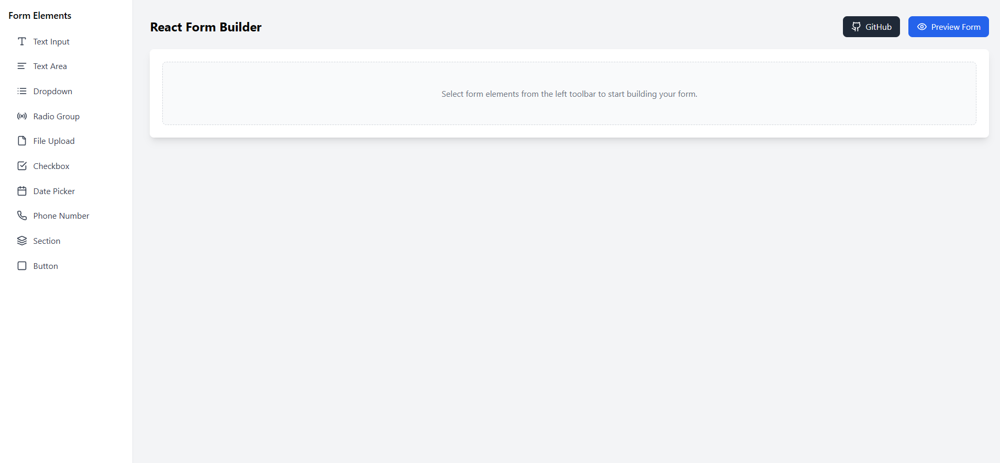

# 📝 Form Builder  

A **React form builder** built with **React**, **Dnd-Kit**, and **Tailwind CSS**. Users can create and manage form templates, reorder fields, and preview forms before finalizing.  



## 🚀 Features  
✅ **Create Form Templates** – Start with a blank form or edit existing templates.  
✅ **Drag & Drop Fields** – Easily rearrange form fields using **Dnd-Kit**.  
✅ **Live Preview** – Toggle between editing and preview modes.  
✅ **Persistent State** – Manage form templates using a global store (**Zustand**).  
✅ **Modern UI** – Built with **Tailwind CSS** for a sleek and responsive design.  

---

## 📦 Tech Stack  
- **Frontend:** React, TypeScript  
- **State Management:** Zustand  
- **Drag & Drop:** Dnd-Kit  
- **Icons:** Lucide React  
- **Styling:** Tailwind CSS  

---

## 🎯 Getting Started  

### **1️⃣ Clone the Repository**  
```bash
git clone https://github.com/Abdulbasit110/React-Form-Builder.git
cd react-form-builder
```

### **2️⃣ Install Dependencies**  
```bash
npm install
```

### **3️⃣ Run the App**  
```bash
npm run dev
```
The app will start at **http://localhost:5173** (or another port if 5173 is in use).

---

## 📂 Project Structure  
```
📦 form-builder  
 ┣ 📂 src  
 ┃ ┣ 📂 components  
 ┃ ┃ ┣ 📜 FormBuilder.tsx  
 ┃ ┃ ┣ 📜 FormField.tsx  
 ┃ ┃ ┣ 📜 Toolbar.tsx  
 ┃ ┃ ┣ 📜 FormPreview.tsx  
 ┃ ┣ 📂 store  
 ┃ ┃ ┣ 📜 formStore.ts  
 ┃ ┣ 📂 styles  
 ┃ ┣ 📜 main.tsx  
 ┣ 📜 README.md  
 ┣ 📜 package.json  
 ┣ 📜 tsconfig.json  
 ┣ 📜 vite.config.ts  
```
---

## 🖥️ Usage  

1. **Select Fields from left Toolbar** – Use the toolbar to add fields and **drag to reorder**.  
2. **Preview Your Form** – Click the **"Preview Form"** button to see the final look.  
3. **Copy the HTML** – Copy and paste your form HTML and use them as you want.  

---

## 🛠️ Contributing  
Pull requests are welcome! If you find a bug or have an idea, please open an **issue**.  

### **Steps to Contribute:**  
1. Fork the repo  
2. Create a new branch (`git checkout -b feature-new`)  
3. Make changes and commit (`git commit -m "Added new feature"`)  
4. Push to the branch (`git push origin feature-new`)  
5. Open a Pull Request  
